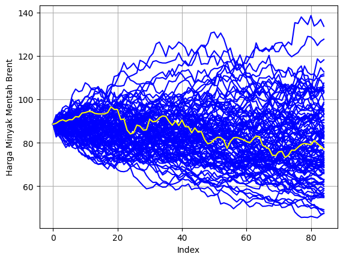
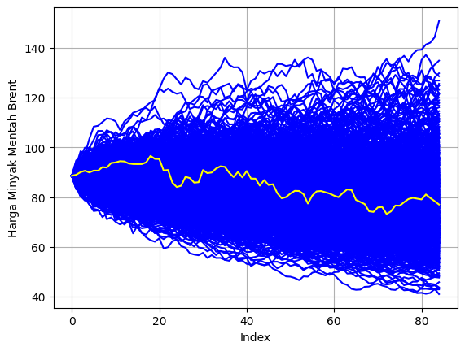
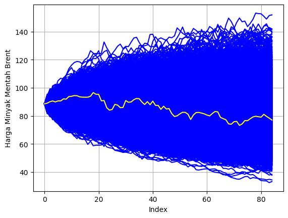
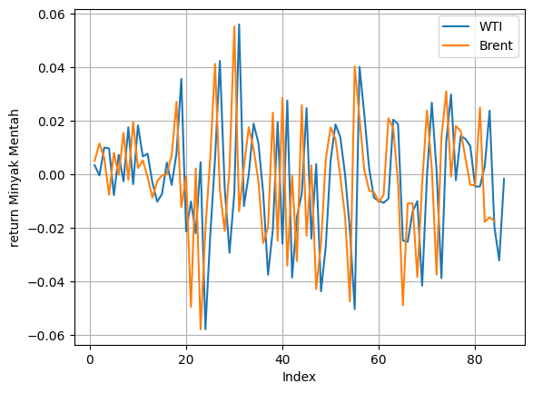

<h1 align="center">
Math Puzzle Game with Kivy
</h1>

Game Pola Barisan adalah permainan yang melatih kemampuan berpikir logis dan mengenali pola bilangan. Pemain harus mengidentifikasi pola yang ada pada barisan angka dan memprediksi angka selanjutnya. Bisa dijalankan di kivymd versi 0.104.2.

<h2 align="center">
Preview Epoch
</h2>

  
  

  <!-- 
   -->

<h2 align="center">
Presented By
</h2>
<h3 align="center">Rafi Rachmad Ramadhan</h3>
 
