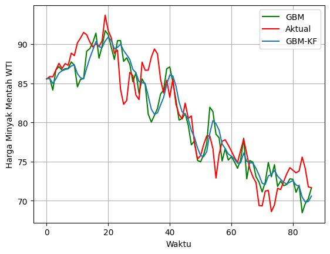
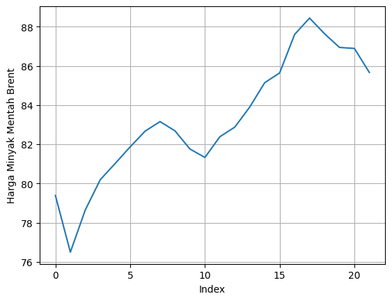

<h1 align="center">
Forcasting Crude Oil Prices Using Geometric Brownian Motion Modified Kalman Filter
</h1>

Prediksi harga minyak mentah jenis West Texas Intermediate dan Brent menggunakan Geometric Brownian Motion termodifikasi Kalman Filter.

<h2 align="center">
Preview
</h2>

  
  
  
  
  
  

<h2 align="center">
Presented By
</h2>
<h3 align="center">Rafi Rachmad Ramadhan</h3>
 
